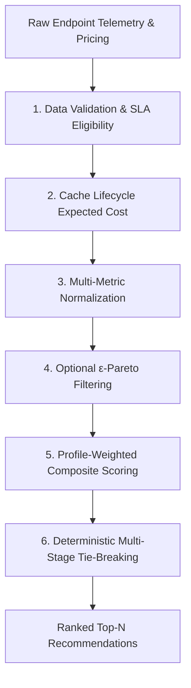

# RouterLens — Production Technical Specification & Scoring Formula

**Document Version:** 2.0  
**Target Audience:** Engineering Leads, System Architects, Quantitative Engineers, Peer Reviewers  

---

## 1. Executive Summary & Problem Context

OpenRouter operates as a multi-provider aggregator where a single AI model (e.g., `deepseek/deepseek-v4-flash`, `openai/gpt-5.6-luna`) can be served simultaneously by dozens of independent backend providers (such as Azure, DeepInfra, StreamLake, Baidu, Amazon Bedrock, Cloudflare).

These providers exhibit substantial variations across:
1. **Pricing Models**: Prompt price, completion price, prompt cache read discounts (`input_cache_read`), and cache write pricing (`input_cache_write`).
2. **Quantization Formats**: Lossless FP16 full precision down to aggressive 4-bit compressions (FP4, AWQ, GPTQ) that degrade reasoning accuracy.
3. **Reliability & Availability**: Recent (30-minute) and historical (1-day) uptime telemetry.
4. **Performance Telemetry**: Time-to-First-Token (TTFT / Latency) and throughput (tokens/second).
5. **Cache Lifecycle Economics**: TTL expiration and sticky-routing cache locality.

**Objective:** Define a deterministic, mathematically normalized composite scoring function with hard SLA eligibility constraints, $\epsilon$-Pareto dominance filtering, workload weight profiles, and explainable multi-dimensional diagnostic scores.

---

## 2. Complete Mathematical Pipeline

---

### Stage 1: Data Validation & Hard SLA Eligibility Constraints

A provider failing fundamental operational or capability requirements is flagged as **Ineligible** and excluded before optimization scoring:

$$\text{Eligible}_i = 
\begin{cases} 
\text{False} & \text{if } \text{Status}_i \neq 0 \text{ (unless IncludeOffline)} \\
\text{False} & \text{if } \text{Uptime30m}_i \le 0.0 \\
\text{False} & \text{if } R_{\text{blended}, i} < \text{MinUptime} \\
\text{False} & \text{if } \text{MaxTTFT} > 0 \text{ and } \text{TTFT}_i > \text{MaxTTFT} \\
\text{False} & \text{if } \text{MinTPS} > 0 \text{ and } \text{TPS}_i < \text{MinTPS} \\
\text{True} & \text{otherwise}
\end{cases}$$

---

### Stage 2: Cache Lifecycle Economics & Expected Cost ($E[P_{\text{prompt}, i}]$)

To model real-world agentic workflows with cache expiration and routing locality:

1. **Cache Survival Probability ($P_{\text{survives}}$)**:
   $$P_{\text{survives}} = e^{-\Delta t / \text{TTL}}$$
   *(where $\Delta t$ is the mean request interval and $\text{TTL}$ is the provider cache retention duration)*

2. **Effective Cache Hit Probability ($P_{\text{eff\_hit}}$)**:
   $$P_{\text{eff\_hit}} = P_{\text{survives}} \times P_{\text{sticky}} \times H_{\text{cache}}$$
   *(where $P_{\text{sticky}} \in [0.0, 1.0]$ is the probability of routing to the same provider)*

3. **Expected Prompt Cost per 1M Tokens**:
   $$E[P_{\text{prompt}, i}] = \left(P_{\text{eff\_hit}} \cdot P_{\text{cache\_read}, i}\right) + \left((1 - P_{\text{eff\_hit}}) \cdot P_{\text{prompt}, i}\right) + \left(\text{Ratio}_{\text{write}} \cdot P_{\text{cache\_write}, i}\right)$$
   *(Fallback rule: If $P_{\text{cache\_read}, i} \le 0$ or $P_{\text{cache\_write}, i} \le 0$ with non-zero prompt price, they default to $P_{\text{prompt}, i}$)*

4. **Blended Token Cost per 1M Tokens ($C_i$)**:
   $$C_i = (W_{\text{prompt}} \cdot E[P_{\text{prompt}, i}]) + (W_{\text{comp}} \cdot P_{\text{completion}, i})$$
   *(Default: $W_{\text{prompt}} = 0.75, W_{\text{comp}} = 0.25$)*

---

### Stage 3: Multi-Metric Normalization $[0.0, 1.0]$

#### A. Cost Score ($S_{\text{cost}, i}$) with Free Tier Cohort Isolation
- **Free Providers** ($C_i = 0$): $S_{\text{cost}, i} = 1.00$.
- **Paid Providers** ($C_i > 0$):
  $$C_{\min,\text{paid}} = \min_{j \in \text{Paid}} C_j$$
  $$S_{\text{cost}, i} = 
  \begin{cases} 
  \frac{C_{\min,\text{paid}}}{C_i} \times 0.90 & \text{if free providers coexist (incentivizing free tier)} \\
  \frac{C_{\min,\text{paid}}}{C_i} & \text{if only paid providers exist}
  \end{cases}$$

#### B. Quantization Quality Score ($S_{\text{quant}, i}$) with Verified First-Party Rule
- **Verified First-Party Registry** (OpenAI, Azure, Amazon Bedrock, Google Vertex / Google, Anthropic) without explicit quantization tag: $S_{\text{quant}} = \mathbf{1.00}$ (Lossless).
- **Strict Degradation Tiers**:
  - `1.00`: FP16 / BF16 / Unquantized (`fp16`, `bf16`, `none`, `full`)
  - `0.60`: 8-bit Precision (`fp8`, `int8`, `8-bit`, `q8`)
  - `0.40 / 0.30`: 6-bit / 5-bit Intermediate (`fp6`, `fp5`)
  - `0.20`: 4-bit Compression (`fp4`, `int4`, `awq`, `gptq`)
  - `0.30`: Unknown / Unlisted fallback

#### C. Bayesian Multi-Window Reliability Score ($S_{\text{rel}, i}$)
1. **Multi-Window Blending**:
   $$R_{\text{blended}} = 0.70 \cdot U_{\text{30m}} + 0.30 \cdot U_{\text{1d}}$$
2. **Bayesian Smoothing Prior** ($\alpha = 99.5\%$ prior mean with weight 10):
   $$R_{\text{smoothed}} = \frac{90 \cdot R_{\text{blended}} + 10 \cdot 99.5}{100}$$
3. **High-Availability Nonlinear Utility**:
   $$S_{\text{rel}} = 
   \begin{cases} 
   0.95 + \frac{R - 99.9}{0.10} \times 0.05 & \text{if } R \ge 99.9\% \\
   0.60 + \frac{R - 98.0}{1.90} \times 0.35 & \text{if } 98.0\% \le R < 99.9\% \\
   0.20 + \frac{R - 90.0}{8.00} \times 0.40 & \text{if } 90.0\% \le R < 98.0\% \\
   \frac{R}{90.0} \times 0.20 & \text{if } R < 90.0\%
   \end{cases}$$

#### D. Time-To-First-Token Score ($S_{\text{ttft}, i}$)
- Missing telemetry: Imputed neutral baseline ($0.60$).
- Target $T_{\text{target}} = 0.50\text{s}$ (500ms):
  $$S_{\text{ttft}} = 
  \begin{cases} 
  1.0 - 0.15 \cdot \left(\frac{T}{0.50}\right) & \text{if } T \le 0.50\text{s} \\
  \frac{0.85}{1.0 + 1.5 \cdot (T - 0.50)} & \text{if } T > 0.50\text{s}
  \end{cases}$$

#### E. Throughput Score ($S_{\text{tps}, i}$)
- Missing telemetry: Imputed neutral baseline ($0.60$).
- Target $\text{TPS}_{\text{target}} = 50\text{ tok/s}$, Benchmark $\text{TPS}_{\text{high}} = 150\text{ tok/s}$:
  $$S_{\text{tps}} = \min\left(1.0, \frac{\text{TPS}}{\text{TPS} + 50} \times \frac{200}{150}\right)$$

---

### Stage 4: $\epsilon$-Pareto Dominance Filtering

To eliminate strictly dominated providers across 5 dimensions ($S_{\text{cost}}, S_{\text{quant}}, S_{\text{rel}}, S_{\text{ttft}}, S_{\text{tps}}$) with tolerance margin $\epsilon = 0.02$ (2%):

Provider $B$ $\epsilon$-dominates Provider $A$ if and only if:
1. $B_m \ge A_m - \epsilon \quad \forall m \in \{\text{Cost, Quant, Rel, TTFT, TPS}\}$
2. $B_k \ge A_k + \epsilon \quad \text{for at least one dimension } k$

*Safety guarantee: If all providers are dominated, the full non-dominated frontier or top candidate is preserved.*

---

### Stage 5: Workload Weight Profiles & Composite Score

$$\text{Score}_i = w_{\text{cost}}' S_{\text{cost}, i} + w_{\text{quant}}' S_{\text{quant}, i} + w_{\text{rel}}' S_{\text{rel}, i} + w_{\text{ttft}}' S_{\text{ttft}, i} + w_{\text{lat}}' S_{\text{lat}, i} + w_{\text{tps}}' S_{\text{tps}, i}$$

#### Pre-Configured Profiles:
| Profile | Description | $w_{\text{cost}}$ | $w_{\text{quant}}$ | $w_{\text{rel}}$ | $w_{\text{ttft}}$ | $w_{\text{tps}}$ | $w_{\text{lat}}$ |
|---|---|:---:|:---:|:---:|:---:|:---:|:---:|
| **`balanced`** (default) | Production balanced tradeoff | **0.40** | **0.25** | **0.15** | **0.10** | **0.10** | **0.00** |
| **`coding`** | Quality & context precision critical | **0.20** | **0.45** | **0.20** | **0.10** | **0.05** | **0.00** |
| **`low_latency`** | Interactive UI & voice agent response | **0.20** | **0.15** | **0.15** | **0.35** | **0.15** | **0.00** |
| **`batch_throughput`** | High-volume async data pipelines | **0.55** | **0.15** | **0.10** | **0.00** | **0.20** | **0.00** |

---

### Stage 6: Deterministic Multi-Stage Tie-Breaking

Ties (within floating tolerance $\delta = 10^{-6}$) are resolved deterministically:
$$\text{Composite Score } \downarrow \quad \longrightarrow \quad \text{Reliability } \downarrow \quad \longrightarrow \quad \text{TTFT } \downarrow \quad \longrightarrow \quad \text{TPS } \downarrow \quad \longrightarrow \quad \text{Context Length } \downarrow \quad \longrightarrow \quad \text{Prompt Price } \uparrow \quad \longrightarrow \quad \text{Provider Name (lexical } \uparrow)$$
